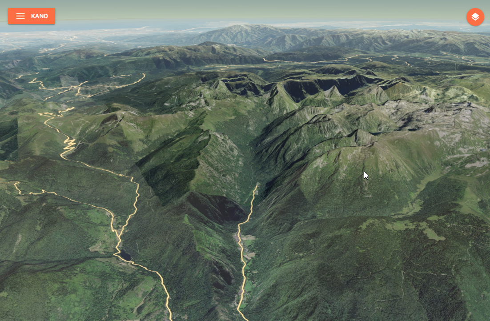
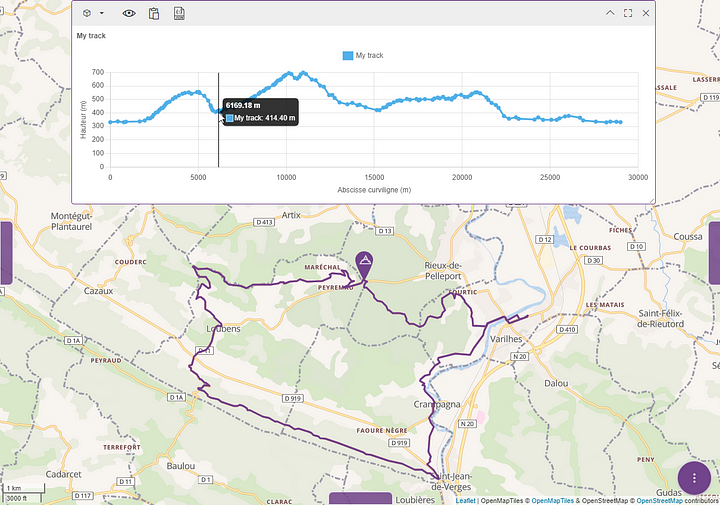

# k2

[](https://github.com/kalisio/k2/releases)
[](https://github.com/kalisio/k2/actions/workflows/main.yaml)
[](https://codeclimate.com/github/kalisio/k2)
[](https://codeclimate.com/github/kalisio/k2/coverage)
[](https://opensource.org/licenses/MIT)

A lightweight service that exposes different endpoints related to terrain data:
- a **3D terrain tiles** endpoint that let you access quantized meshes in MBTiles for Cesium,
- an **elevation** endpoint that let you compute the elevation of the terrain under a linear geographical element.





You can serve either serve:
- a single terrain file by specifying it through the `TERRAIN_FILEPATH` environment variable,
- multiple terrain files in a folder by specifying it through the `TERRAIN_FOLDER` environment variable, all `*.mbtiles` file will be served.

## API

### /healthcheck (GET)

Check for service's health, return a json object with a single member `isRunning`.

### /layer.json (GET)

Return layer metadata in json format for a single terrain file.

### /:z/:x/:y.terrain (GET)

Get an individual tile for a single terrain file (i.e. the tile located at `x`,`y`,`z`).

### :terrain/layer.json (GET)

Return layer metadata in json format for the given terrain file when multiple fils are server from a folder.
The `terrain` parameter is expected to be the terrain file basename in lower case without the extension, e.g. `myterrain` for the `/mbtiles/myterrain.mbtiles` file.

### :terrain/:z/:x/:y.terrain (GET)

Get an individual tile for given terrain file when multiple fils are server from a folder (i.e. the tile located at `x`,`y`,`z`).
The `terrain` parameter is expected to be the terrain file basename lower case without the extension, e.g. `myterrain` for the `/mbtiles/myterrain.mbtiles` file.

### /elevation?resolution=res (POST)

Computes the elevation of the terrain under a linear geographical element (i.e. a path/trajectory) based on available elevation data and a requested target resolution. By default, the elevation dataset will be selected depending on the resolution according to the following rules:
* resolution < 250m: [SRTM v4](https://csidotinfo.wordpress.com/data/srtm-90m-digital-elevation-database-v4-1/),
* resolution < 500m: [GMTED 2010](https://www.usgs.gov/coastal-changes-and-impacts/gmted2010) - Maximum 7.5 arc-seconds grid,
* resolution < 1000m: [GMTED 2010](https://www.usgs.gov/coastal-changes-and-impacts/gmted2010) - Maximum 15 arc-seconds grid,
* otherwise: [GMTED 2010](https://www.usgs.gov/coastal-changes-and-impacts/gmted2010) - Maximum 30 arc-seconds grid.

> [!WARNING]
> When GMTED dataset is selected the **maximum elevation** within each elevation grid cell will be returned, otherwise the **mean elevation** is returned.

The `elevation` endpoint allows to post a body that must conform a **GeoJSON** feature defining the target geographical element `geometry` with the following configuration properties: 
| Name            | Description                                                                                                                                                       | Default value |
|-----------------|-------------------------------------------------------------------------------------------------------------------------------------------------------------------|---------------|
| `resolution`    | Interval, in meters, between two elevation samples over the profile source.                                                                                       | `30` meters   |
| `concurrency`   | How many segments will be computed in parallel server side.                                                                                                       | `4`           |
| `demOverride`   | The name of an elevation dataset to use for custom datasets. k2 will auto select a dataset if empty.                                                              | `""`          |
| `corridorWidth` | The width, in meters, of a corridor to consider "around" the path for computation. The computed elevation will be the max elevation of all the covered samples.   | `0`           |

The `POST` body must contain the GeoJSON to use as elevation profile source. If the GeoJSON is a `FeatureCollection`, then only the first feature will be used in the computation.

> [!TIP]
> The configuration properties can also be passed as query parameters.

The endpoint result is a **GeoJSON** feature collection defining the sample points `geometry` with the following `properties`: 
* `z` defines the computed elevation of the sampled point taking margin into account,
* `t` defines the computed curvilinear abscissa of the sampled point along the path.

> [!IMPORTANT]
> The elevation computation will set to `0` any source sample whith a `nodata` value.

## Building

### Manual build 

You can build the image with the following command:

```bash
docker build -t <your-image-name> .
```

### Automatic build using GitHub Actions

This project is configured to use GitHub Actions to build and push the image on the Kalisio's Docker Hub.
The built image is tagged using the `version` property in the `package.json` file.

## Deploying

This image is designed to be deployed using the [Kargo](https://kalisio.github.io/kargo/) project.

Check out the [compose file](https://github.com/kalisio/kargo/blob/master/deploy/k2.yml) to have an overview on how the container is deployed.

## Contributing

Please read the [Contributing file](./.github/CONTRIBUTING.md) for details on our code of conduct, and the process for submitting pull requests to us.

## Versioning

We use [SemVer](https://semver.org/) for versioning. For the versions available, see the tags on this repository.

When releasing a patch, minor or major version, i.e. the following tasks have to be done:
- increase the package version number in the package.json file
- create a tag accordingly in the git repository and push it

The command `npm run release:<type>`, where  `<type>` is either `patch`, `minor` or `major`, will do the job for you ! 

## Converting GeoTIFF to MBTiles

1. Run a [cesium-terrain-builder-docker](https://github.com/tum-gis/cesium-terrain-builder-docker) container with a volume mounted on the folder with your GeoTIFF files : `docker run -it --name ctb -v "./path/to/geotiff/:/data" tumgis/ctb-quantized-mesh`
2. Build a virtual dataset with all of the GeoTIFF files : `gdalbuildvrt dataset.vrt /data/*.tif`
2. Reproject data to EPSG:4326 : `gdalwarp -s_srs EPSG:2154 -t_srs EPSG:4326 dataset.vrt dataset-EPSG4326.vrt`
3. Build overview images : `gdaladdo -r average dataset-EPSG4326.vrt 2 4 8 16`
4. Generate quantized meshes with [cesium-terrain-builder-docker](https://github.com/tum-gis/cesium-terrain-builder-docker?tab=readme-ov-file#create-cesium-terrain-files) : `ctb-tile -f Mesh -C -N -o /target/path/for/generated/quantized/meshes/ dataset-EPSG4326.vrt`
5. Generate layer.json : `ctb-tile -f Mesh -C -N -l -o /target/path/for/generated/quantized/meshes/ dataset-EPSG4326.vrt`
6. Outside of the container, [get](./scripts/quantized_mesh2mbtiles.py) the `quantized_mesh2mbtiles.py` script from this project, and generate MBTiles file from quantized meshes : `python quantized_mesh2mbtiles.py /path/to/quantized/meshes/ terrain.mbtiles`

## Authors

This project is sponsored by 


## License

This project is licensed under the MIT License - see the [license file](./LICENSE.md) for details
